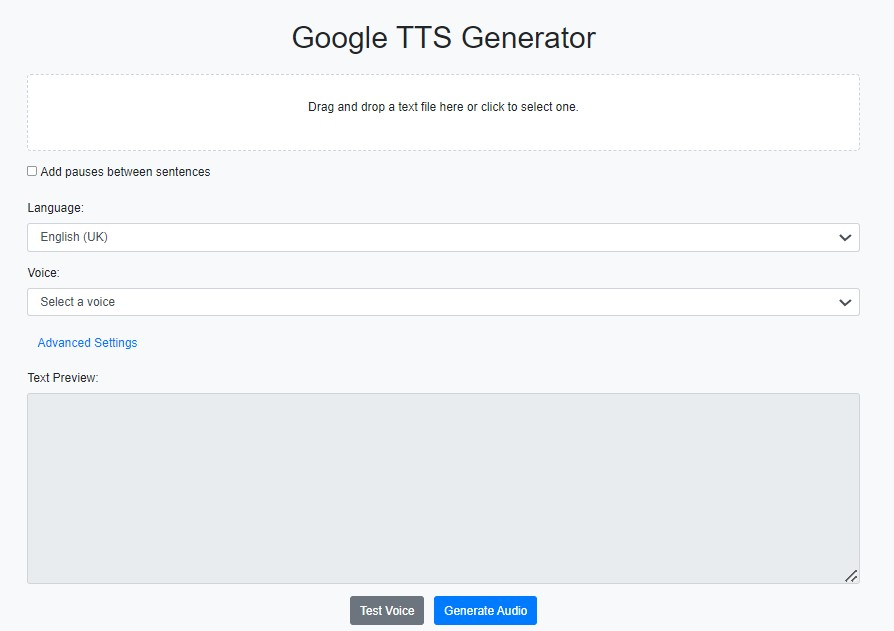

# Text-to-Speech Generator

This project is a web application that converts text to speech using Google Cloud's Text-to-Speech API. Users can upload a text file, select a language and corresponding voice, and generate an audio file of the text being read aloud.


## Features

- Upload text files for conversion
- Support for multiple languages:
  - English (US, UK, AU)
  - Spanish (Spain, US)
  - German
  - Dutch
  - Japanese
  - Italian
  - French
  - Portuguese (Portugal, Brazil)
  - Turkish
- Filtered voice options based on the selected language
- Various voice types:
  - Standard
  - WaveNet
  - Neural2
  - Polyglot
  - Studio
- Customizable speaking rate and pitch
- Voice testing before full audio generation
- Quota usage tracking for characters and bytes consumed per voice type
- MP3 audio file generation and download
- Responsive web design for desktop and mobile use

## Prerequisites

Before you begin, ensure you have met the following requirements:

- [Node.js](https://nodejs.org/) (v14 or later) installed on your system
- A Google Cloud account with the Text-to-Speech API enabled
- A Google Cloud service account key (JSON file)

## Installation

1. Clone the repository:
   ```bash
   git clone https://github.com/davidCorreaEngineer/TextToAudio.git
   cd TextToAudio
   ```

2. Install dependencies:
   ```bash
   npm install
   ```

3. Set up your Google Cloud credentials:
   - Place your Google Cloud service account JSON key file in the project root directory.
   - Rename it to `keyfile.json` (or update the path in `app_server.js` if using a different name).

## Configuration

1. Open `app_server.js` and ensure the `keyFilename` path is correct:
   ```javascript
   const client = new textToSpeech.TextToSpeechClient({
     keyFilename: path.join(__dirname, 'keyfile.json')
   });
   ```

2. (Optional) Modify the `MAX_TEXT_LENGTH` constant in `app_server.js` if you want to change the maximum allowed text length.

## Running the Application

1. Start the server:
   ```bash
   node app_server.js
   ```

2. Open a web browser and navigate to `http://localhost:3000`

## Usage

1. **Upload a text file**: 
   - Drag and drop a text file onto the designated area, or
   - Click the area to open a file picker and select your text file.

2. **Select language and voice**:
   - Choose your desired language from the dropdown menu.
   - Select a voice from the filtered options for that language.

3. **Adjust settings** (optional):
   - Modify the speaking rate and pitch using the sliders.
   - Check the "Add pauses between sentences" option if desired.

4. **Test the voice** (optional):
   - Click "Test Voice" to hear a sample of the selected voice and settings.

5. **Generate Audio**:
   - Click "Generate Audio" to create an MP3 file of your text.

6. **Download**:
   - Once generation is complete, click the "Download Audio" button to save your MP3 file.

## Monitoring Usage

The dashboard at the bottom of the page displays:
- Total usage across all voice types
- Number of unique voices used
- Current month's usage
- Consumption by voice type with progress bars

## Troubleshooting

- If you encounter CORS issues, ensure your Google Cloud project has the necessary permissions set up.
- For "Quota Exceeded" errors, check your Google Cloud Console for current quota limits and usage.

## Contributing

Contributions to improve the Text-to-Speech Generator are welcome. Please follow these steps:

1. Fork the repository
2. Create a new branch (`git checkout -b feature/AmazingFeature`)
3. Commit your changes (`git commit -m 'Add some AmazingFeature'`)
4. Push to the branch (`git push origin feature/AmazingFeature`)
5. Open a Pull Request

## License

"Commons Clause" License Condition v1.0

The Software is provided to you by the Licensor under the License, as defined below, subject to the following condition.

Without limiting other conditions in the License, the grant of rights under the License will not include, and the License does not grant to you, the right to Sell the Software.

For purposes of the foregoing, "Sell" means practicing any or all of the rights granted to you under the License to provide to third parties, for a fee or other consideration (including without limitation fees for hosting or consulting/ support services related to the Software), a product or service whose value derives, entirely or substantially, from the functionality of the Software.
MIT License - see the [LICENSE](LICENSE) file for details.

## Acknowledgments

- Google Cloud for providing the Text-to-Speech API
- The open-source community for the various libraries used in this project